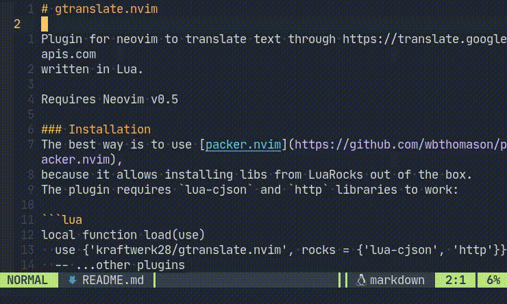

# gtranslate.nvim

Plugin for neovim to translate text through https://translate.googleapis.com

### Installation:

Via [packer.nvim](https://github.com/wbthomason/packer.nvim):
```lua
use {"kraftwerk28/gtranslate.nvim", requires = {"nvim-lua/plenary.nvim"}}
```

Via [vim-plug](https://github.com/junegunn/vim-plug):
```vimscript
Plug 'kraftwerk28/gtranslate.nvim'
Plug 'nvim-lua/plenary.nvim'
```

### Configuration (optional)

```lua
require("gtranslate.nvim").setup {
  default_to_language = "English"
}
```

### Usage:

- Select the text to translate (visual mode);
- Run one of the following commands:

```vimscript
:Translate <from-language> <to-language>
:Translate <to-language> " In that case, the <from-language> is automatic
:Translate " Translate to <default_to_language>; <from-language> is automatic
```

### Showcase:


